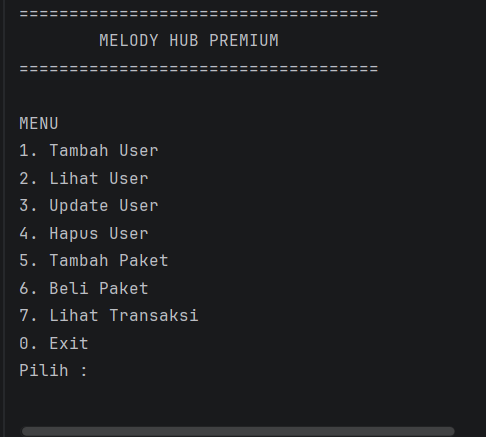
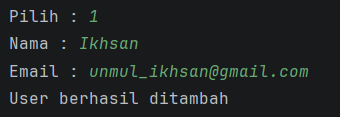
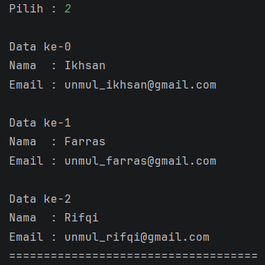
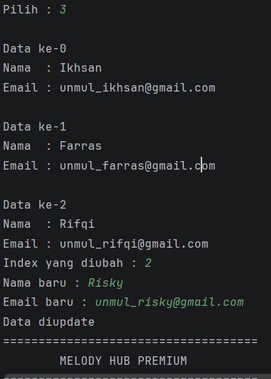
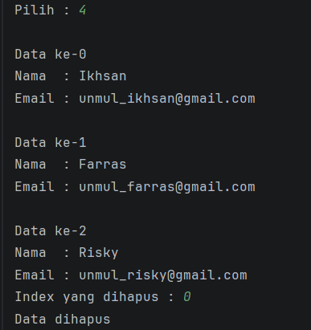
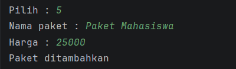
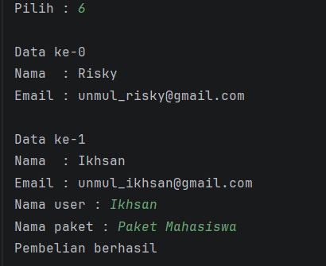
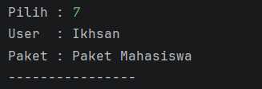

Nama    : Ikhsan
Nim     : 2409106118

Posttest 1

Berikut adalah output Menu MelodyHub, yang memiliki 8 menu. CRUD User, Tambah Paket, Beli Paket, Lihat Transaksi dan Exit atau keluar.

Berikut Contoh I/O dari CRUD User:

Dari tambah user kita dapat menambahkan nama dan juga email pemilik akun, dan apa bila sudah menginput makan program akan mengulang untuk memilih menu kembali.

ini adalah proses read atau melihat usernya, dari sini kita dapat melihat berapa banyak akun yang sudah terdaftar di program ini

update atau edit user, berguna untuk mengubah data user yang sudah terdaftar di program. dapat mengubah nama dan email.

delete atau hapus user, seperti namanya, ini adalah proses menghapus atau menghilangkan data dari program.

tambah paket berguna seperti tambah user, ini adalah proses penambahan data paket. yang di input disini adalah nama paket itu sendiri dan juga harga paket tsb.

beli paket ini juga sama seperti tambah paket dan tambah user, bedanya disini adalah proses menggabungkan kedua data, misalnya akun Ikhsan membeli paket mahasiswa. lalu kedua data dari data paket dan data user di gabung.

lihat transaksi adalah proses melihat data pembelian paket, seperti contohnya user ikhsan membeli paket mahasiswa.

dan yang trakhir 0.Exit atau program selesai.

tysm.